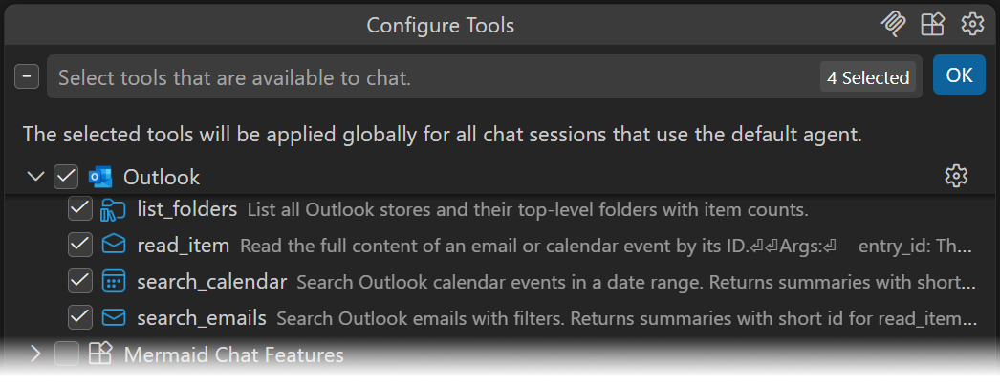

# Outlook MCP Server

An MCP server that exposes Outlook emails and calendar events to AI assistants via COM automation.

**Tools:** `list_folders`, `search_emails`, `search_calendar`, `read_item`



## Setup

```
pip install -r requirements.txt
python server.py
```

Requires a running Outlook instance on Windows.

## IDE Integration

Add this to your IDE's MCP configuration (e.g. `claude_desktop_config.json` or `.mcp.json`):

```json
{
  "mcpServers": {
    "Outlook": {
      "command": "python",
      "args": ["C:\\Users\\your-username\\outlook-mcp\\server.py"]
    }
  }
}
```
