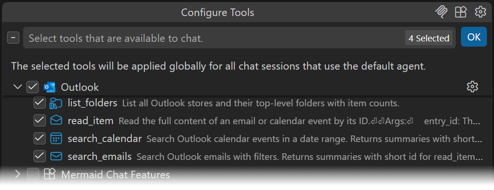

# Outlook MCP Server

An MCP server that exposes Outlook emails and calendar events to AI assistants via COM automation.

- **Tools:** `list_folders`, `search_emails`, `search_calendar`, `read_item`
- **Prompts:** `weekly_summary`, `agenda`, `next_meeting`, `unanswered_emails`, `annual_review`



## Setup

```
pip install git+https://github.com/DevinBerchtold/outlook-mcp
```

Requires a running Outlook instance on Windows.

This installs an `outlook-mcp` command. You can also run it as a module with `python -m outlook_mcp`.

## IDE Integration

Add this to your IDE's MCP configuration (e.g. `claude_desktop_config.json` or `.mcp.json`):

```json
{
  "mcpServers": {
    "Outlook": {
      "command": "outlook-mcp"
    }
  }
}
```

Or, if the `outlook-mcp` command isn't on your `PATH`, use the module form instead:

```json
{
  "mcpServers": {
    "Outlook": {
      "command": "python",
      "args": ["-m", "outlook_mcp"]
    }
  }
}
```
